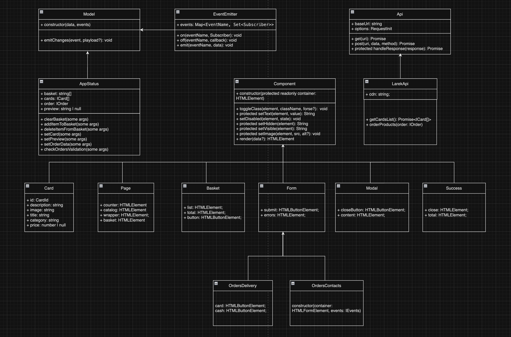

# Проектная работа "Веб-ларек"

Стек: HTML, SCSS, TS, Webpack

Структура проекта:
- src/ — исходные файлы проекта
- src/components/ — папка с JS компонентами
- src/components/base/ — папка с базовым кодом

Важные файлы:
- src/pages/index.html — HTML-файл главной страницы
- src/types/index.ts — файл с типами
- src/index.ts — точка входа приложения
- src/styles/styles.scss — корневой файл стилей
- src/utils/constants.ts — файл с константами
- src/utils/utils.ts — файл с утилитами

## Установка и запуск
Для установки и запуска проекта необходимо выполнить команды

```ts
npm install
npm run start
```

или

```ts
yarn
yarn start
```
## Сборка

```ts
npm run build
```

или

```ts
yarn build
```

## Архитектура


## Базовый код
### 1. Класс EventEmitter
Реализует паттерн «Наблюдатель» и позволяет подписываться на события и уведомлять подписчиков о наступлении события.
Класс имеет методы `on` ,  `off` ,  `emit`  — для подписки на событие, отписки от события и уведомления подписчиков о наступлении события соответственно.
Дополнительно реализованы методы  `onAll` и  `offAll`  — для подписки на все события и сброса всех подписчиков.

События, обрабатываемые классом `EventEmitter`
- `basket:open` - запускает callback, который запрашивает у класса AppStatus актуальное состояние корзины, с помощью Modal.render() выводит на экран попап с содежимым корзины; на кнопку Оформить вешается слушатель клика, запускающий событие `ordersDelivery:open`, на кнопку закрытия попапа (крестик) вешается слушатель клика, по которому попап закрывается;
- `basket:changed` - запускает callback, который запрашивает у класса AppStatus список товаров в корзине; далее, если такого товара в корзине нет, то добавляет этот товар, увеличивает количество товара в корзине (счетчик) и общую стоимость корзины (`total`); далее, на кнопку удаления каждого из добавленных товаров устанавливается слушатель клика, который, в свою очередь запускает метод удаления товара из корзины и обновляет общую стоимость корзины;
- `items:changed` - запускает callback, который формирует карточки товаров (`Card`); на каждую из карточек устанавливается обработчик события `card:select`;
- `card:select` - запускает callback, вызывающий метод `setPreview`, который, в свою очередь, запускает обработчик событие `preview:changed`;
- `preview:changed` - запускает callback, который берет id карточки, запрашивает по нему всю информацию о выбранном товаре, формирует превью и с помощью Modal.render() выводит на экран попап с выбранным товаром; на кнопку добавления товара в корзину вешается слушатель клика, который в свою очередь, запускает событие `item:check`;
- `item:check` - проверяет есть ли такой товар в корзине, если такого товара нет, то запускается событие `item:add`, который добавляет товар в объект заказа, в противном случае, если такой товар существует, запускается событие `item:delete`, удаляющее товар из корзины;
- `ordersDelivery:open` - запускает callback, который с помощью Modal.render() и данных класса OrdersDelivery формирует и отображает модальное окно с формой ввода адреса доставки и выбора способа оплаты; на кнопки выбора способа оплаты вешается слушатель, запускающий событие `paymentMethod:changed`, которое, в свою очередь, запписывает выбранный способ оплаты в `AppStatus.order.payment`, на поле ввода вешается слушатель события ввода с клавиатуры, который запускает событие `ordersDelivery:changed`; на кнопку закрытия (крестик) вешается слушатель, который закрывает модальное окно и очищается форму ввода адреса доставки и выбранный способ оплаты;
- `ordersDelivery:changed` - запускает callback, который записывает данные в `AppStatus.order.address`, а так же валидирует поля ввода с помощью метода `checkOredersDeliveryValidation()`; на кнопку Далее вешается слушатель сабмита формы, запускающий событие `ordersContacts:open` в случае, если валидация поля прошла успешно;
- `ordersContacts:open` - запускает callback, который с помощью Modal.render() и данных класса OrdersContacts формирует и отображает модальное окно с формой ввода телефона и адреса электронной почты; на поля ввода вешается слушатель события ввода с клавиатуры, запускающий событие `ordersContacts:changed`; на кнопку закрытия попапа устанавливается слушатель события клика, который закрывает модальное окно, очищая при этом поля ввода формы контактов и формы доставки;
- `ordersContacts:changed` - запускает callback, который который записывает введенные данные в `AppStatus.order.phone` и `AppStatus.order.email`, а так же валидирует поля ввода данных с помощью метода `checkOredersContactsValidation()`; в случае успешной валидации кнопка Оплатить становится активной и на нее устанавливется слушатель события `order:submit`;
- `order:submit` - запускает callback, отправляющий сформированный объект заказа на сервер и, получив ответ об успешном оформлении заказа, очищает корзину и все формы заказа, сбрасывает состояние выбора способа оплаты и далее запускает событие `success:open`;
- `success:open` - запускает callback, который с помощью Modal.render() и данных класса Success отображает на экране попап с информирование об успешном оформлении заказа.

### 2. Класс Api
Данный класс осуществляет работу с базовыми запросами к серверу (GET, POST, PUT, DELETE) и занимается обработкой ответов, полученных от сервера.
Класс имеет методы: 
- `get` и `post` - для выполнения самх запросов к серверу, 
- `handleRespons` - для обработки ответа сервера, его парсинга и обработки ошибок.

### 3. Класс Component
Базовый класс, который наследуется всеми классами, отвечающим за отрисовку интерфейса на экране. Предоставляет методы классам-наследникам для управления разметкой.

В состав класса входят методы:
- `toggleClass` - для переключения класса конкретного DOM-элемента,
- `setText` - для установки текста в свойство textContent конкретного DOM-элемента,
- `setDisabled` - для "отключения" переданного DOM-элемента,
- `setHidden` - для скрытия конкретного DOM-элемента,
- `setVisible` - для показа конкретного DOM-элемента,
- `setImage` - для установки изображения (src) и альтернативного текста (alt) для конкретного DOM-элемента,
- `render` - возвращает container, по которому с помощью метода `replaceChildren` отрисовываются элементы разметки.

### 4. Класс Model
Базовый класс, предназначенный для создания модельных данных, используемых для управления данными приложения. Напрямую "общается" с EventEmitter, принимая в конструктор данные модели и аргумент `events`.

Включает в себя только один метод:
- `emitChanges` - для сообщения всем подписчикам о том, что модель изменилась. 

## Компоненты модели данных
### 1. Класс AppStatus
Класс для хранения актуального состояния приложения: данные о товаре, корзине, превью, заказе и ошибках. 
Наследуется от Модели (`Model<IAppStatus>`).

Методы класса:
- `clearBasket` - для очистки данных корзины,
- `addItemToBasket` - для добавления конкретного товара в корзину,
- `deleteItemFromBasket` - для удаления конкретного товара из корзины,
- `setCards` - для отрисовки каталога товаров,
- `setPreview` - для открытия предпросмотра товара,
- `setOrderDelivery` - для установки данных по доставке заказа,
- `setOrdersContacts` - для установки данных о контактах,
- `checkOrdersValidation` - для валидации формы заказа.

## Компоненты представления
Гипотетические классы:
- класс Basket - корзина, наследуется от Component (`Component<IBasket>`)
- класс Card - карточка товара, наследуется от Component (`Component<ICard>`)
- класс OrderDelivery - отображает и управляет формой ввода данных о доставке, наследуется от Component (`Component<IOrderDelivery>`)
- класс OrdersContacts - отображает и управляет формой ввода контактных данных, наследуется от Component (`Component<IOrdersContacts>`)
- класс Modal - универсальное модальное окно, наследуется от Component (`Component<IModal>`)
- класс Success - отображает информационное сообщение об успешной покупке, наследуется от Component (`Component<ISuccess>`)
- класс Page - собирает на главную страницу корзину со счетчиком и товары. наследуется от Component (`Component<IPage>`)

## Ключевые типы данных
```ts
type CardId = string; //uuid?

//Интерфейсы базовых классов

export type EventName = string | RegExp;
export type Subscriber = Function;
export type EmitterEvent = {
    eventName: string,
    data: unknown
};

export interface IEvents {
    on<T extends object>(event: EventName, callback: (data: T) => void): void;
    emit<T extends object>(event: string, data?: T): void;
    trigger<T extends object>(event: string, context?: Partial<T>): (data: T) => void;
}

export type ApiListResponse<Type> = {
    total: number,
    items: Type[]
};

export type ApiPostMethods = 'POST' | 'PUT' | 'DELETE';


//Интерфейсы моделей данных
export interface IAppStatus {
    basket: string[],
    cards: ICard[],
    order: IOrder,
    preview: string | null,
}

//Интерфейсы компонентов представления

export interface ICard {
    id: CardId,
    description: string,
    image: string,
    title: string,
    category: string,
    price: number | null,
}

export interface IOrdersDelivery {
    payment: string,
    address: string,
}

export interface IOrdersContacts {
    email: string,
    phone: string,
}

export interface IOrder extends IOrdersDelivery, IOrdersContacts {
    total: number | null,
    items: CardId[],
}

export interface IOrderSuccess {
    id: string, //uuid?
    total: number | null,
}

export interface ISuccess {
    image: string,
    title: string,
    description: string,
    total: number | null,
}

export interface IBasket {
    items: HTMLElement[];
    total: number;
}

export type FormErrors = Partial<Record<keyof IOrder, string>>;
```